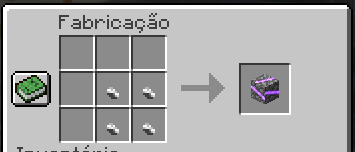

# :icon-package: Minérios

Estes minérios são utilizados para a criação de armaduras, ferramentas, armas e outros itens!

===## :icon-package: Lista de Minérios
!!!info Raridade dos Minérios:
!!!
Minério         | Raridade
---             | ---
Lasca de Pedra  | Comum
Pedra Reforçada | Comum

!!!info Chance de Drop dos Minérios:
!!!

Minério         | Como é ganho | Chance
---             | --- | ---
Lasca de Pedra  | Minerando Pedra | 1%
Pedra Reforçada | Açando | 100%
Pedra Compactada | Craftando | 100%

===## :icon-package: Craft dos Minerios
Minérios de Pedra:
+++ Pedra Reforçada
1x Lasca de Pedra (Na Fornalha)
+++ Pedra Compactada
4x Pedra Reforçada

+++
